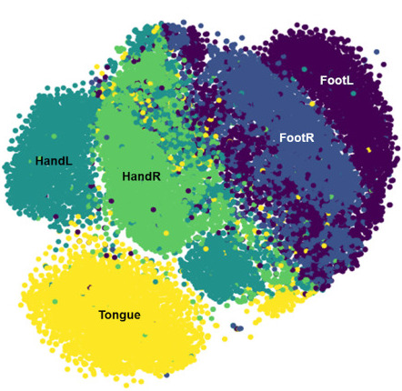

Can we decode many tasks simultaneously with fMRI? how many time points do we need? New paper out with @YuZhang2bic @BertrandThirion Spoiler: deep (graph) learning outperforms traditional machine learning with ~1M @HumanConnectome brain images

First let's talk about the dataset. We used task fMRI from @HumanConnectome
 with N~1k subjects, 7 task domains including 21 specific conditions we tried to decode, and about ~1k brain images per subject (across all conditions).

 The main model was a graph convolutional network (GCN), with 6 convolutional layers (32 filters per layer), and 2 fully connected layers. The graph: Glasser parccellation and a group functional connectome. Baselines: support vector classifiers (SVC) and random forest (RF).

 

 Using a time window of 10 seconds, it is possible to decode the 21 conditions simultaneously with an average test accuracy of 90%. Here's the confusion matrix, looking very diagonally.

 

 Looking at single time points (~700 ms of data), it's still possible to decode accurately the condition (here foot movement). The accuracy increases over time following the onset of the condition. This likely reflects the characteristics of  the hemodynamic response.  

 

 And how much data do we need to train this GCN? a lot. Performance reaches a plateau for about 200 subjects, representing hundreds of thousands of time points.

 

 The GCN outperformed all our baselines by at least 10% accuracy for 10s long data, and as much as 25% accuracy for SVC-linear. So at least for some tasks and a massive number of brain images, deep learning has the potential to shine

 Finally, @YuZhang2bic also looked at saliency maps to get a feel of what the GCN learned. Top contributing regions had good face validity. There is a number of additional control experiments in the paper.

 

 Huge thanks to @HumanConnectome for making this amazing data resource available, @CNeuromod
 @IVADO_Qc for funding, and @IUGM @UMontreal @Parietal_INRIA @ai_unique for being wonderful, supportive environments for neuroAI projects.
