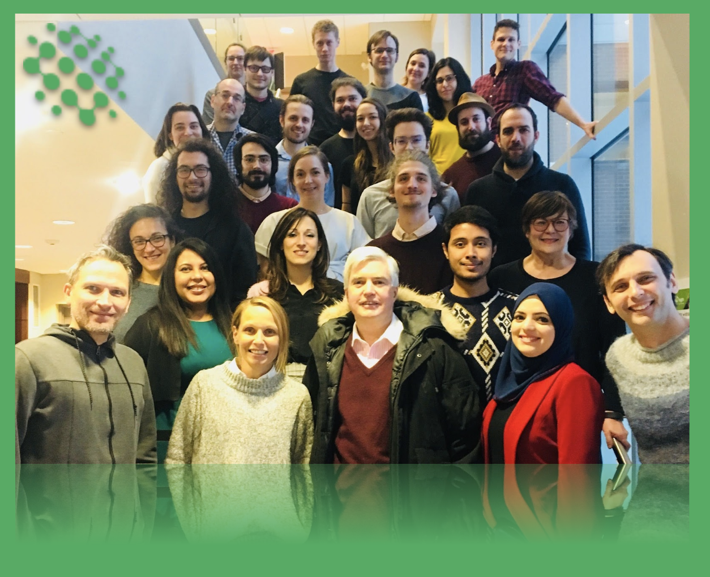
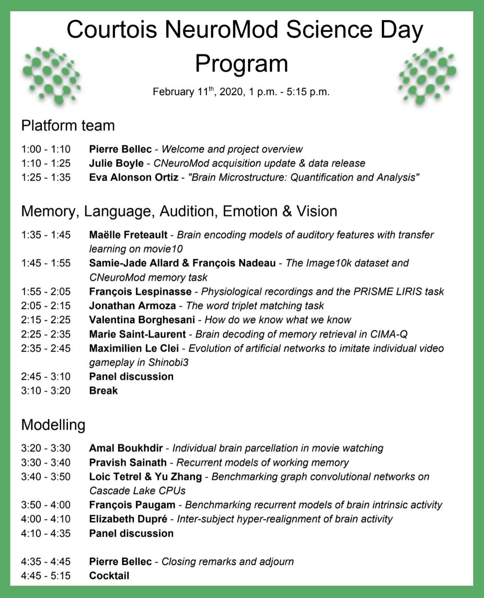

Hi! I'm Valentina, the latest recruit of CNeuroMod and thus clearly the right person to introduce you to this talented herd of nerds. 

One of the strengths of NeuroMod is undoubtedly the multidisciplinary nature of its team. Computer scientists, engineers, neuroscientists: anyone can have fun with us! There is a Core, leading us and providing the vision, but the action is very distributed, with crews focusing on MRI and MEG data acquisition, Modeling or Computing. Finally, we have squads tackling different cognitive functions: vision, audition, memory, language, emotions, and video games. There's lot about video games going on... An updated list of our contributors can be found in our latest [documentation](https://docs.cneuromod.ca/en/latest/AUTHORS.html). 

Last February, at the Amphitheatre Le Groupe Maurice at the IUGM Research Centre, we held the first Courtois NeuroMod Science Day. Team members, collaborators and friends gathered to share updates on the status of all major projects and to foreshadow our next steps. The first harvest included our alpha (internal) [data release](https://www.cneuromod.ca/posts/release_2020alpha/) and a sneak peek to our scientific outcomes. If you'd like to know more, check out the preprint ["Bridging the gap between perception and action: the case for neuroimaging, AI and video games" ](https://psyarxiv.com/3epws ).

This June, while getting ready for our next data release (oh, yes, it's coming!), we will introduce our team members with a Twitter campain: [follow us](https://twitter.com/CNeuromod) and get to know the amazing characters behind CNeuromod!
